# ISSessions CTF 2025 -- Piece of the Pie (Thought Process + Solution)
## Disclaimer
I (cultureshocked / 3354 / Conrad) solved this challenge after the event ended. That is why our team name does not show on the list of solutions. I wanted to tackle more of the challenges afterwards to develop my skills further and just get more experience in general, and in doing so, I managed to solve this challenge.

## Background
I'm primarily a Linux user, and while I can emulate/virtualize Windows programs to run them on my computer, I'd rather not, especially if it incurs overhead or adds complexity to the task at hand. So, to solve this challenge, I employed purely static-analysis methods, without actively debugging the application or otherwise running it. I've written a bit of Win32 code before, so I'm not jumping into this challenge completely blind.

## Hints
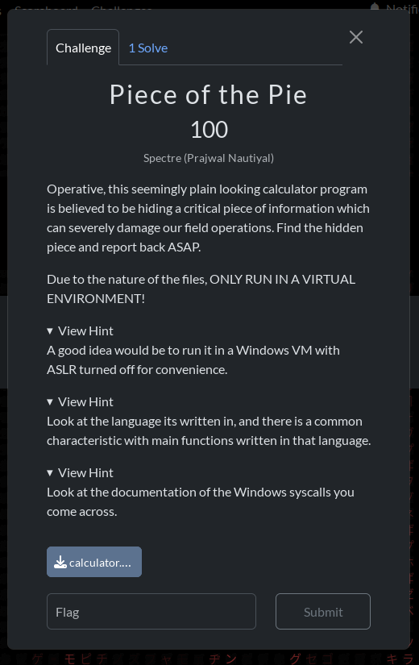

None were _too_ helpful, as they seemed to hint at actually running the program to see how it behaves, especially with ASLR being a runtime feature. However, hinting at the language was a bit helpful, because most of the other RE challenges I tackled were written in C only. I'm glad this hint was included, because when I opened up the binary in BinaryNinja, I was greeted with the following:

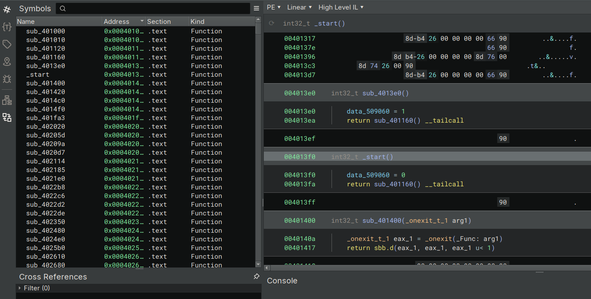

The binary was completely stripped of symbols; all that remained were symbols that were necessary for import at runtime (e.g., Windows-related functions)

Well, we've got an entrypoint and a chain of functions that perform the usual CRT startup stuff, like calling global constructors, so let's keep double-clicking anything not labeled with `exit` or `noreturn` and see if anything interesting pops up.

## `main`
Eventually, after clicking through some of the function calls during initialization, we come across something that looks like this:

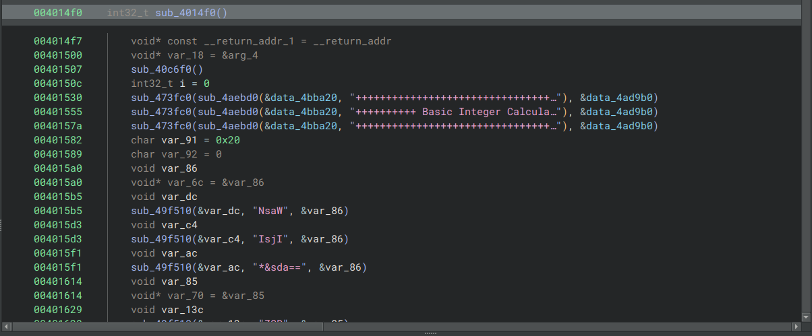

Now, I don't know about you, but `0x401530` through `0x40157a` look an awful lot like print-statements. And those function calls and C-strings look an awful lot like base64.

If we look carefully, we see that before each base64-string-function-call, there is a `void` being declared on the stack, and a pointer to that entry on the stack is being passed into `sub_49f510()` as the first argument. There is another argument, another address after the C-string, but it's not particularly useful (and FWIW, Ghidra ignores it entirely.)

The hint about 'languages' and the sheer amount of function calls on my screen are whispering to me: "this is a C++ binary." Thankfully, it actually looks really _tame_ for a C++ binary and likely uses C++ in the old "C with classes" way of writing mostly procedural code while making use of `std::vector` and `std::string`.

So, with all of that, we can start cleaning up the code a bit. I'm still extremely new to BinaryNinja, having only gotten my license about a week ago, so I'm sticking to the C-style disassembly and instead renaming the calls and types like C typedefs rather than telling Binja to figure out namespacing.

## Multiple Strings
Normally, I would have already tried to decode all the b64 strings myself and hope it spits something out at me.

The problem here, though, is that there are multiple strings all put together differently. This is a typical "stack strings" way of embedding a string into a binary without a utility like `strings` dumping all the information back out, but there's some added complexity insofar as scrambling up multiple strings, as denoted by the multiple `=` padding bytes see in `stdstr_j` and `stdstr_t`. While the other `var_83` or `var_82` kinds of variables might be indicative of some kind of delimiting, it's still not guaranteed it's what I'm looking for, so for now, we'll pursue regular program execution with our new symbol names.

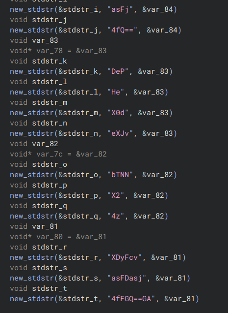

## Last Iteration
This is, in fact, a calculator.

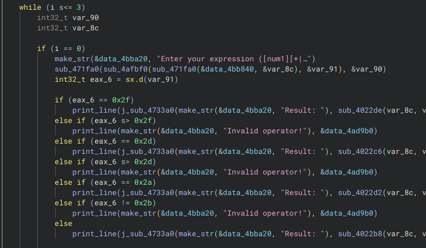

You may notice something interesting, though: there are only three iterations, and if we scroll down a bit, we find something more interesting that occurs on the last iteration (e.g., `i == 2`):

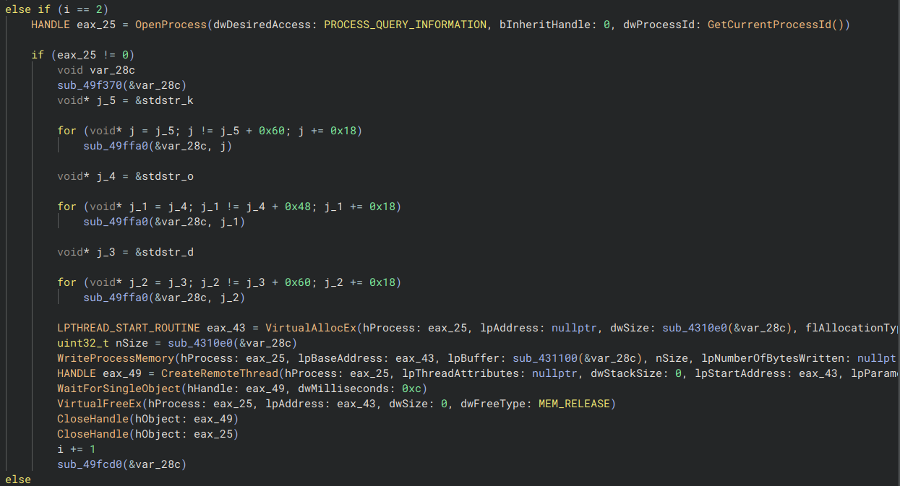

Wow, alright. We have some real Win32 stuff going on now. These symbols are all external, so we don't need to decode them, and by extension, we can make use of their definitions to declare some new symbol names.

Before we do that, we should figure out what those three `for`-loops are doing, though, as they are modifying `var_28c` which is being used everywhere later on.

All three loops call `sub_49ffa0`, so let's see if we can immediately figure out what it does, as it might give us a hint as to what this whole block does.

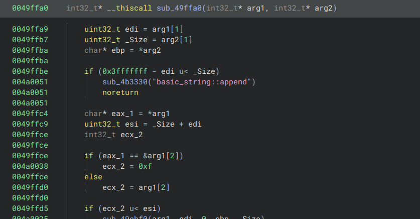

Well, the code _looks_ a bit complicated, with even BinaryNinja's HLIL making heavy use of registers to describe behaviour, but that string is a very nice saving-grace. This function performs `std::string::append()` or something similar to `strcat` in C.

And if we go back to that block from earlier, we find that `var_28c` is likely a `std::string` being operated on. Let's fill in some of these symbols, now.

## Win32
Before going any further, I do want to slow down and figure out what the Win32 segment is doing. This is roughly what's going on:
1. `VirtualAllocEx` is creating some new memory
2. `WriteProcessMemory` writes some data to that memory.
3. `CreateRemoteThread` creates a new thread under the current process (`calculator.exe`) with the memory from `[1]` as its "code."
4. `WaitForSingleObject` will wait either for the thread to finish executing _or_ 12 milliseconds, whichever comes first.
5. `VirtualFreeEx` will free the memory allocated in `[1]`
6. `CloseHandle` will close the handle to the thread and the process.

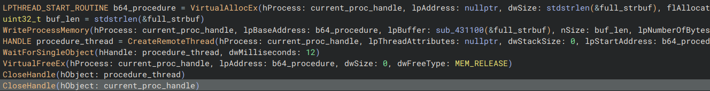

During this part, we should also figure out what that `sub_4310e0` function does, as it's used twice.

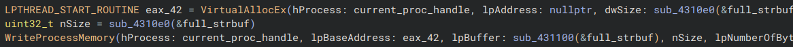
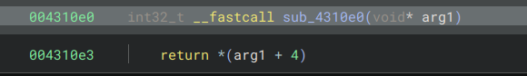

Interesting, it just reads the raw data 4 bytes from the pointer passed in. There are probably a couple things to recall right now:

1. This binary had its symbols stripped, and by extension probably has some compile-time optimization in-place.
2. The binary is built for 32bit Windows, not 64bit. 

If we combine those two things, we'll find that the length of a `std::string` is actually the second field in the structure. Using godbolt to illustrate the point, at `-O2` it optimizes out any explicit call to `std::string::size()` or otherwise, and just sets `eax` to four bytes of the string on the stack at offset 4.

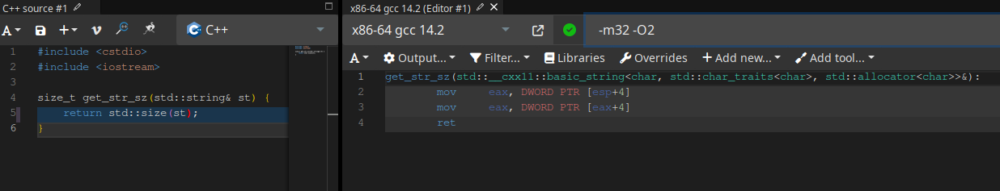

And, after a little more cleanup, our code looks like this:

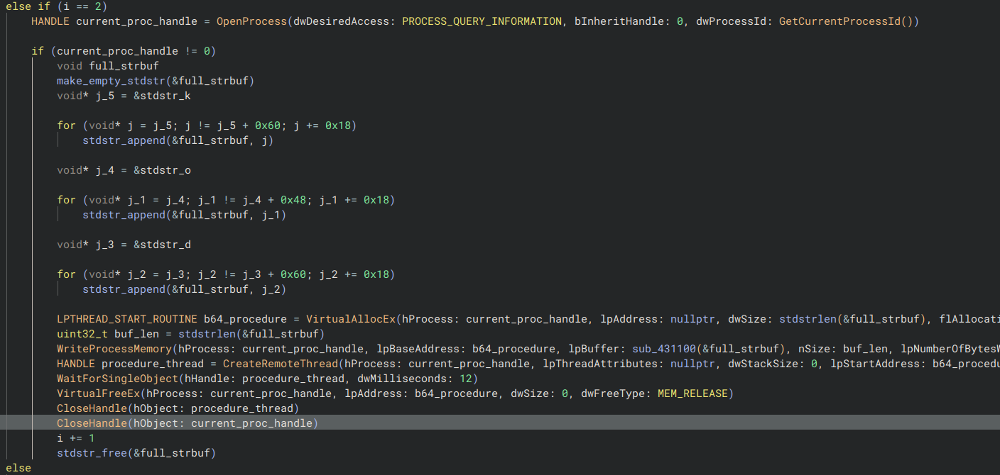

Generally speaking, I'm pretty happy with that, for now.

## `std::string` sizes, and stack offsets
I'm on Linux, and have very little intention of booting into a VM and trying to move all my work over at this point, so instead of trying to run the code and setting my silly little breakpoints, I'm going to put together some data myself. Those three `for`-loops look promising, as they're referencing all those tiny base64-resembling strings from earlier on.

It's probably a really good idea to figure out what the condition actually is, first.

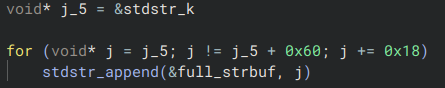

Basically, we get the address of the string, and increment by `0x18` or decimal 24, and we **_stop_** right when we get to `0x60` or decimal `96`. It might be helpful to recognize that `0x60` is actually `4 * 0x18`, and since `0x60` is out stop condition, our loop will iterate over `0x0`, `0x18`, `0x30`, `0x48` only, or a total of `4` iterations.

Well, we've established that the whole `stdstr_X` section was effectively a more roundabout way of using stack strings, so let's go take another look at our 'stack'. We're starting at `k`...

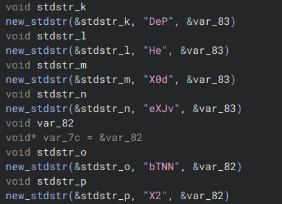

And certainly, `stdstr_k` is at a stack offset of `-0x1e4` while `stdstr_l` is found at `-0x1cc`, or a total of `0x18` bytes apart. So, unlike that little `std::size` function earlier, we are not looking into the actual in-memory structure: we are looking at multiple strings.
Thus, in our `for`-loop, `j` is going to point at the strings [`k`, `l`, `m`, `n`\], and put them all together in our buffer.

The next loop will take three strings (loop breaks at `0x48`) from `o` string, or [`o`, `p`, `q`\]...

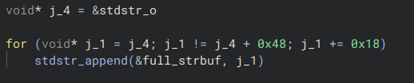

And the one after that will take another 4 strings starting at `d`, or [`d`, `e`, `f`, `g`\].

## Putting it together
Just putting the strings together by hand in CyberChef yields this result:

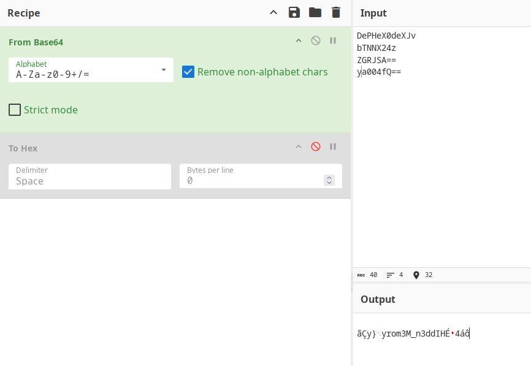

By now, one piece of information should be immediately obvious: `HIdd3n_M3mory` written backwards.
When written in the flag format (`bhbureauCTF{HIdd3n_M3mory}`), it passes the check.

# Conclusion + Final Thoughts
I'm not sure where the base64 is actually decoded into the shellcode (at least, I presume that's what all the Win32 stuff was doing,) so perhaps I did cheese this challenge a bit. If I did just use a debugger in a Windows VM, I could just set a breakpoint right before the `OpenProcess` call and just look at the stack for the fully assembled base64 string. Would have made this challenge a lot simpler than all the symbol re-declaration that I was doing, but sometimes, that digging can be extremely valuable, as not only did I refresh my knowledge of `std::string` and test my understanding of some Win32 functions, it forced me to actually go and look at the patterns and think about them to arrive at some conclusion about what goes on.

Thanks to the organizers and sponsors of the event!
